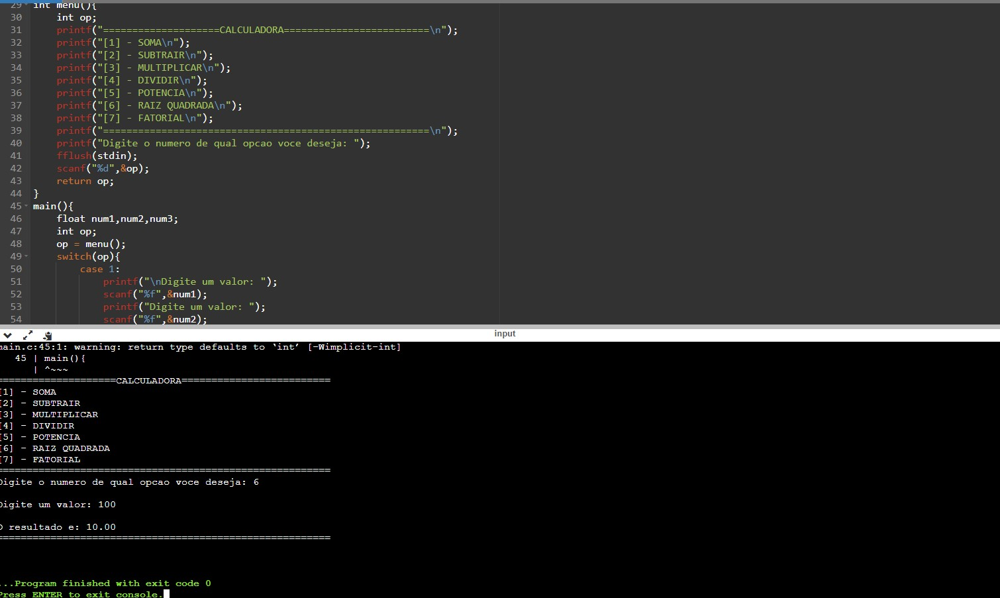

# CALCULADORA

<h2>ATIVIDADE</h2>

Calculadora com as opções de soma,subtração,divisão,multiplicação,raiz quadrada, fatorial e potência.

<h2>Tecnologias</h2>

- C 

- GIT e GitHub 

<h2>Contato</h2>

viktorariel777@gmail.com

